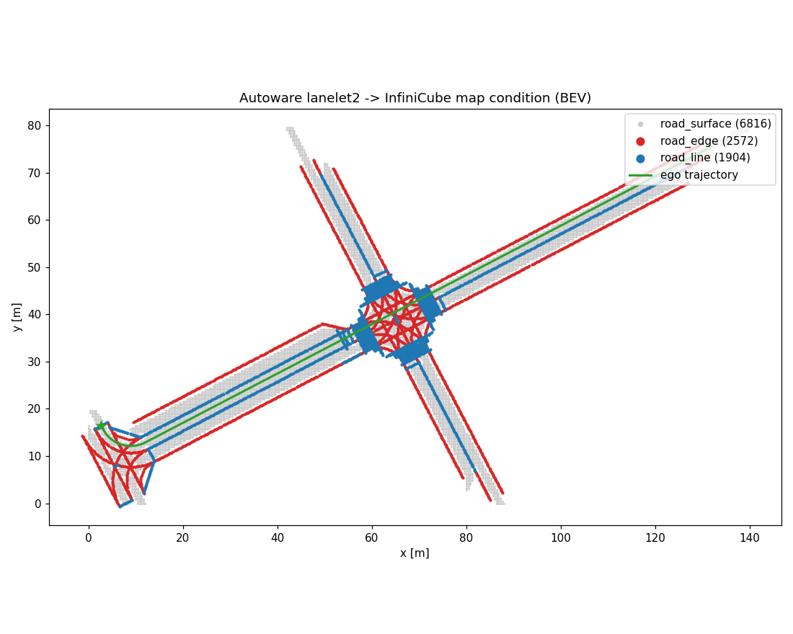

# Autoware HD Map (Lanelet2) Support

InfiniCube conditions its voxel-world diffusion model on three map point clouds —
`road_edge`, `road_line`, `road_surface` — plus an ego trajectory. In the original
pipeline these come from the Waymo Open Dataset. This integration lets you drive the
**same pretrained checkpoints from a real Autoware HD map** (a Lanelet2 `.osm` file).

The Lanelet2 map is parsed with [`simple_lanelet2`](https://github.com/hakuturu583/simple_lanelet2),
a pip-installable, drop-in Lanelet2 Python API that needs **no C++/Boost toolchain**.

Converter: [`infinicube/data_process/autoware_hdmap_to_wds.py`](../infinicube/data_process/autoware_hdmap_to_wds.py)



*A converted Autoware intersection: gray = `road_surface`, red = `road_edge`,
blue = `road_line`, green = ego trajectory.*

---

## How the mapping works

| InfiniCube primitive | Source in Lanelet2 |
| --- | --- |
| `road_surface` | drivable area, densely sampled between the left/right bound of every drivable lanelet (subtype `road` / `road_shoulder`), then cleaned with the same block-plane estimator as the Waymo pipeline |
| `road_line` | interior lane dividers (bounds shared by two drivable lanelets) + standalone markings (`line_thin`, `line_thick`, `stop_line`, `pedestrian_marking`) |
| `road_edge` | outer extent of the drivable region (bounds used by a single lanelet) + physical edges (`road_border`, `curbstone`, `guard_rail`, `fence`, `wall`) + `virtual` boundaries |

Discretization (`road_edge`/`road_line` at 0.25 m) and road-surface estimation reuse
the **exact same helpers** as the Waymo pipeline
(`polylines_to_discrete_points`, `estimate_road_surface_in_world`), so the output is
byte-format-identical to native InfiniCube webdataset shards.

**Coordinate frame:** Autoware maps carry MGRS `local_x` / `local_y` / `ele` node
tags — a consistent planar metric frame — which the converter uses directly. Maps
without those tags fall back to a UTM projection centered on the map origin. Map
points and ego poses always share the same world frame; ego poses are stored in the
opencv convention InfiniCube expects.

---

## Setup (CPU-only — no VRAM)

The converter is a pure data-preparation step. It needs **no GPU** and does not
allocate any VRAM, so it can run alongside training on the same machine. It lives in
its own lightweight environment, separate from the heavy PyTorch/fvdb inference env.

```bash
cd <InfiniCube-repo>

# create an isolated CPU-only env
uv venv .venv-lanelet --python 3.10
source .venv-lanelet/bin/activate

# lanelet2 parser + data deps (all CPU wheels)
uv pip install simple-lanelet2 "numpy<2.0.0" webdataset scipy loguru tqdm \
    scikit-image scikit-spatial pyquaternion trimesh
uv pip install torch==2.2.0 --index-url https://download.pytorch.org/whl/cpu
```

> The `torch==2.2.0+cpu` wheel guarantees `torch.cuda.is_available() == False`, so
> nothing here can touch the GPU.

---

## Convert a map

```bash
source .venv-lanelet/bin/activate

CUDA_VISIBLE_DEVICES="" PYTHONPATH=. \
python infinicube/data_process/autoware_hdmap_to_wds.py \
    --osm sample_maps/lanelet2_map.osm \
    --clip my_autoware_scene \
    --output_root data
```

This writes the full InfiniCube webdataset layout needed by **Steps 1–3**:

```
data/
├── 3d_road_edge_voxelsize_025/my_autoware_scene.tar     # road_edge.npy   (N,3)
├── 3d_road_line_voxelsize_025/my_autoware_scene.tar     # road_line.npy   (N,3)
├── 3d_road_surface_voxelsize_04/my_autoware_scene.tar   # road_surface.npy(N,3)
├── pose/my_autoware_scene.tar                           # {i:06d}.pose.front.npy (4,4) opencv
├── intrinsic/my_autoware_scene.tar                      # intrinsic.front.npy [fx fy cx cy W H]
├── static_object_info/my_autoware_scene.tar             # per-frame, empty (no baked vehicles)
└── dynamic_object_info/my_autoware_scene.tar            # per-frame, empty
```

The `intrinsic` and per-frame `static/dynamic_object_info` tars are what the guidance-
buffer / scene-Gaussian stages (Steps 2–3) require; Step 1 only reads the road clouds,
`pose`, and `static_object_info`.

Useful flags: `--segment_interval` (polyline discretization, default 0.25 m),
`--surface_spacing` (0.4 m), `--pose_spacing` (0.5 m), `--ego_z_offset` (sensor height,
default 0), `--traj_max_len` (cap the trajectory length in meters; default = **full
route**, the map-scale trajectory needed for full-scene reconstruction), `--pose_stride`
(subsample pose density), and camera-intrinsic overrides `--img_width/--img_height/
--hfov_deg/--vfov_deg` (defaults 832×480, 50.1°×34.6° → fx≈890, fy≈771, cx=416, cy=240).

### Full-scene reconstruction (whole map, not one 51.2 m chunk)

A single voxel world covers only one grid crop. To reconstruct and fly through the
**whole** Kashiwanoha route, run Step 1 over the full trajectory, then use the
orchestrator `infinicube/inference/full_scene_from_autoware.py`, which loops Steps 2–3
over every voxel world and accumulates the Gaussians into one scene. Validate the plan
with `--dry-run` (CPU only, no GPU); see `FULLSCENE_NOTES.md` for the ready-to-run
command and the coordinate-frame note (all voxel worlds share the first-camera frame, so
the chunks concatenate directly).

### Get a sample Autoware map

```bash
mkdir -p sample_maps
gh api "repos/autowarefoundation/autoware_core/contents/testing/autoware_test_utils/test_map/lanelet2_map.osm" \
    --jq '.download_url' | xargs curl -fsSL -o sample_maps/lanelet2_map.osm
```

---

## Run voxel-world generation on the converted map

The clip is a drop-in for `--mode trajectory`. This step **does** use the GPU:

```bash
conda activate infini   # the main InfiniCube inference env (see README/env.md)

python infinicube/inference/voxel_world_generation.py none \
    --mode trajectory \
    --use_ema --use_ddim --ddim_step 100 \
    --local_config infinicube/voxelgen/configs/diffusion_64x64x64_dense_vs02_map_cond.yaml \
    --local_checkpoint_path checkpoints/voxel_diffusion.ckpt \
    --clip my_autoware_scene \
    --webdataset_root data \
    --target_pose_num 8
```

Then continue with Guidance Buffer Generation and Scene Gaussian Generation exactly
as in the main [Quick Start](../README.md).

---

## Verifying the conversion (no GPU)

Every produced clip is validated to be read-identical to native Waymo shards via
`get_wds_data`: `(N,3)` float32 map point clouds, `(K,4,4)` float64 opencv ego poses
with orthonormal rotations, and an empty `(0,8,3)` box set. A BEV sanity plot is
written to `sample_maps/autoware_map_condition_bev.png`.
